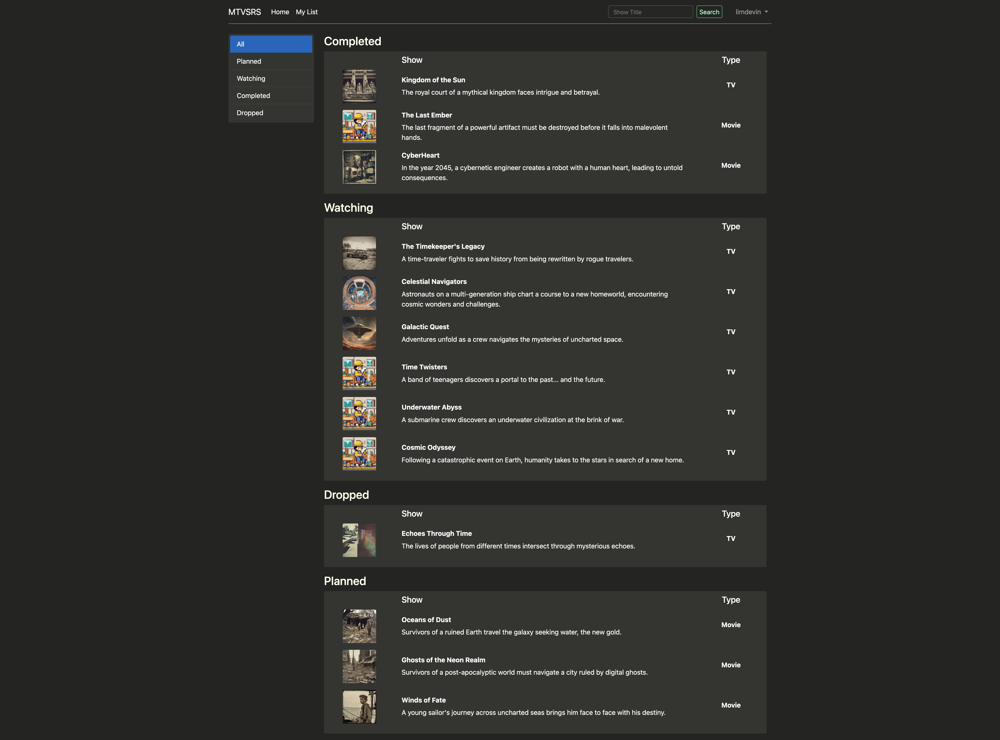
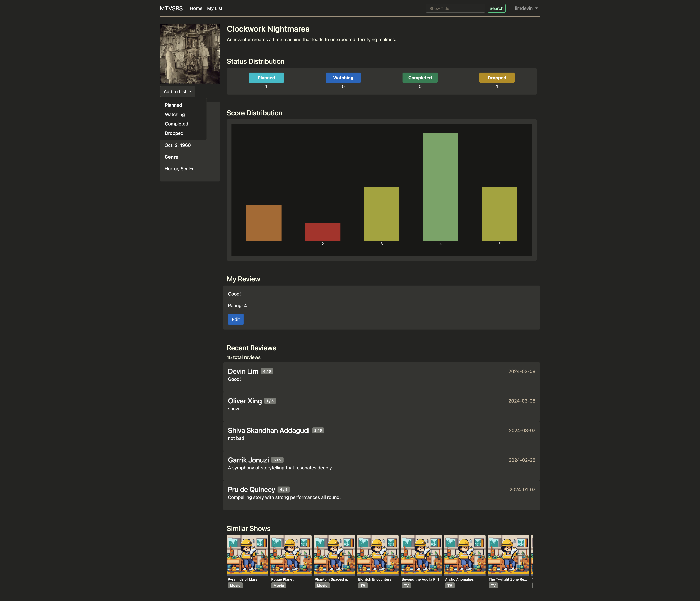
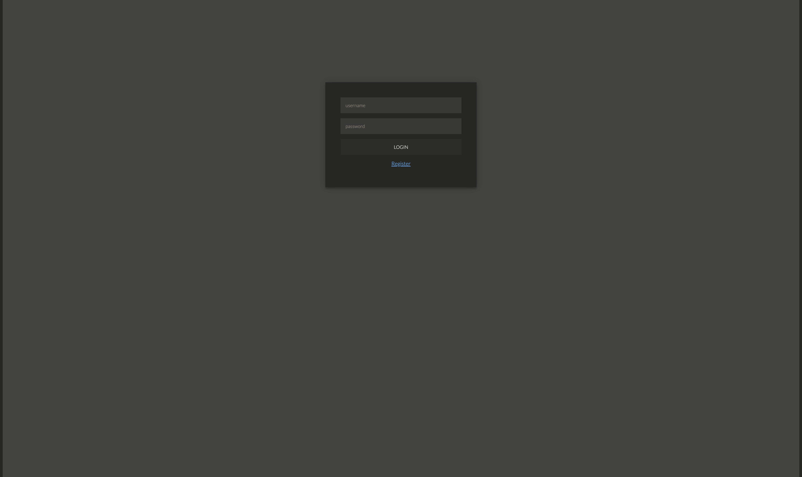
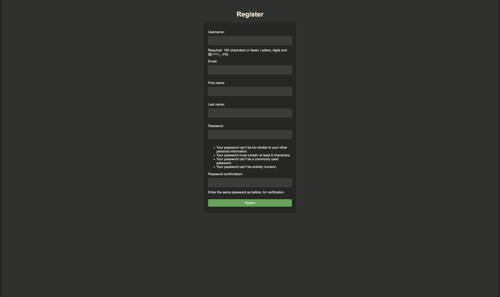

## Description

Movie and TV Series Recommendation System (MTVSRS) is an app that allows users to track movies and TV series that
they've watched, and get recommendations based on their preferences ala myanimelist.

It's currently live on http://3.85.11.137 -- You will have to register an account first as lots of the feature depend on
user data.

All assets and data are AI generated (OpenAI's GPT and Stable Diffusion), see https://github.com/CPSC5071/mockagpt

## EC2 and NGINX Setup

Install essentials, NGINX, MariaDB (mostly to provide mysql_config which is used by mysqlclient package for Django's
connector) and the official Ansible role

```
sudo yum -y install git python-pip mariadb105-devel gcc python3.9-devel
pip install ansible 
ansible-galaxy install nginxinc.nginx
```

Clone this repo, which includes playbook.yml, then run:

```
git clone https://github.com/CPSC5071/mtvsrs.git
ansible-playbook playbook.yml
```

Make changes to /etc/nginx/nginx.conf to redirect to port 8000, use the file in repo.

(Not best practice, should modularize configs in conf.d/)

```
sudo cp nginx.conf ~/etc/nginx/nginx.conf
```

Enable (or just start) the NGINX service

```
sudo systemctl enable nginx
```

Generate new Django SECRET_KEY (which really is more of a *salt*..) to environment, as we shouldn't hardcode secrets.

```
echo "export SECRET_KEY='$(openssl rand -hex 40)'" > .DJANGO_SECRET_KEY
source .DJANGO_SECRET_KEY
```

Change the password in settings.py

```
DATABASES = {
    "default": {
        "ENGINE": "django.db.backends.mysql",
        "NAME": "mm_team06_01",
        'USER': 'admin',
        'PASSWORD': '<INSERT PASSWORD HERE>',
        'HOST': 'cpsc5071.cnsskm04otsd.us-east-1.rds.amazonaws.com',
        'PORT': '3306',
    }
}
```

Start Django app as a background process

```
pip install -r requirements.txt
python3 manage.py migrate
nohup python3 manage.py runserver --insecure &
```

NOTE:

In a real prod scenario, we shouldn't be using Django's default web server, use something like Gunicorn
instead (https://docs.djangoproject.com/en/3.2/ref/django-admin/#runserver)

> DO NOT USE THIS SERVER IN A PRODUCTION SETTING. It has not gone through security audits or performance tests.
> (And that’s how it’s gonna stay. We’re in the business of making Web frameworks, not Web servers, so improving this
> server to be able to handle a production environment is outside the scope of Django.)

## Pulling changes and connecting to EC2

After new changes have been merged to main branch, we need to SSH to our EC2 (ask Devin for pem file)

```
ssh -i devin.pem ec2-user@3.85.11.137 
```

Pull the changes and restart the server. Running insecure mode otherwise Django server won't serve static files if debug
is disabled.

```
cd mtvsrs
git pull
source .DJANGO_SECRET_KEY
kill $(ps aux | grep "[p]ython3 manage.py runserver" | head -n 1 | awk '{print $2}')
python3 manage.py migrate
nohup python3 manage.py runserver --insecure &
```

## Local Development

1. Get .DJANGO_SECRET_KEY file from Devin, then run command `source .DJANGO_SECRET_KEY`
2. In settings.py:
    1. Set DEBUG to True
    2. Set DB Password
3. Run the server:

```
pip install -r requirements.txt
python3 manage.py migrate
python3 manage.py runserver
```

## Screenshots

Home Page


My List Page



Show Page



Login Page



Registration Page



Sketches

